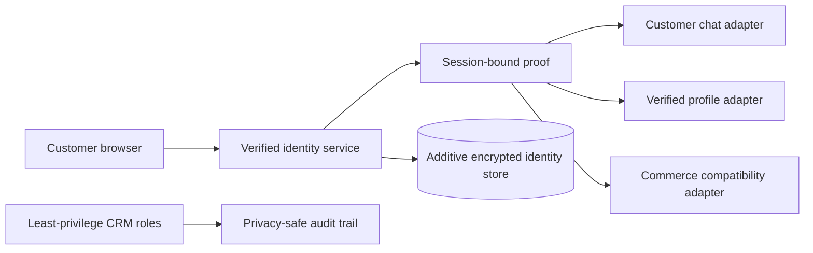

# Customer Identity Security Architecture

Public showcase of a security-first identity foundation designed for a high-traffic WordPress and WooCommerce customer platform.

## Current milestone

Version 0.2.0 marks the first privately reviewed implementation foundation. The approved architecture now has a testable, versioned codebase, while runtime activation remains deliberately disabled.

No database schema has been applied, no customer data has been processed, and no staging or Production behavior has changed.

## What this milestone delivers

- A centralized contract for verified customer identity
- Consistent mobile input validation and safe navigation handling
- Explicit fail-closed boundaries for future integrations
- Repeatable packaging, quality checks, and privacy safeguards
- Clear approval gates before migration, pilot, or deployment

## What the architecture improves

- Centralized verified-mobile identity instead of independent trust rules across customer surfaces
- Transaction-safe OTP lifecycle with replay protection, atomic limits, device binding, and privacy-safe observability
- Session-bound verification provenance so an ordinary login cookie is not mistaken for recent identity proof
- Deterministic, fail-closed handling of duplicate and privileged identities without automatic merges
- Customer-owned chat and profile access derived from the authenticated session rather than browser-supplied identifiers
- Additive, versioned storage that avoids disruptive changes to existing commerce and CRM data
- Sensitive-route cache isolation while preserving cache performance for public catalog pages
- Least-privilege CRM operations, audited overrides, and archive/void semantics in place of destructive actions
- Progressive delivery with backup/restore evidence, isolated staging, shadow validation, limited rollout, and secure rollback

## High-level boundary

## Verified foundation safeguards

- Localized mobile input is normalized consistently and malformed values are rejected safely.
- Navigation targets are constrained to the trusted site boundary.
- The private foundation remains unavailable if its reviewed runtime boundary cannot be verified.
- Repeatable checks cover compatibility, packaging integrity, dependency health, and accidental private-data disclosure.
- The distributable foundation is separated from development and verification tooling.

## Approved delivery safeguards

The approved architecture requires encrypted identity storage, abuse controls, request idempotency, concurrency safety, session revocation, privacy-safe observability, secure recovery, and performance protection before runtime activation. Those operational controls remain subject to separate migration, staging, pilot, and Production approvals.

## Delivery status

| Stage | Status |
|---|---|
| Read-only audit | Complete |
| Architecture and security contracts | Complete |
| Private implementation foundation | Complete; deliberately non-operational |
| Isolated staging preparation | Approved; no deployment performed |
| Migration and pilot validation | Pending separate approvals |
| Production | Not started |

The private repository contains the reviewed implementation and verification history. Production source, credentials, customer data, infrastructure identifiers, and sensitive security details are intentionally excluded from this showcase.
