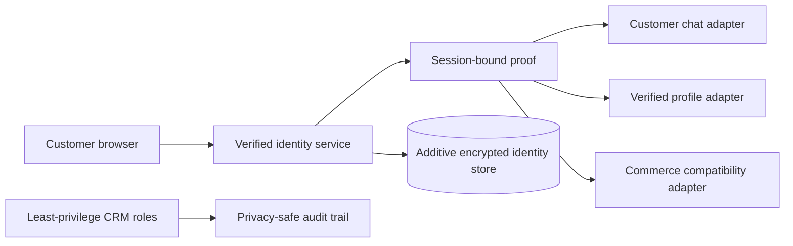

# Customer Identity Security Architecture

Public showcase of a security-first identity foundation designed for a high-traffic WordPress and WooCommerce customer platform.

## Current milestone

The architecture and security contracts are complete and under private review. This milestone is design-only: it does not claim a staging or production deployment.

## What the design improves

- Centralized verified-mobile identity instead of independent trust rules across customer surfaces
- Transaction-safe OTP lifecycle with replay protection, atomic limits, device binding, and privacy-safe observability
- Session-bound verification provenance so an ordinary login cookie is not mistaken for recent identity proof
- Deterministic, fail-closed handling of duplicate and privileged identities without automatic merges
- Customer-owned chat and profile access derived from the authenticated session rather than browser-supplied identifiers
- Additive, versioned storage that avoids disruptive changes to existing commerce and CRM data
- Sensitive-route cache isolation while preserving cache performance for public catalog pages
- Least-privilege CRM operations, audited overrides, and archive/void semantics in place of destructive actions
- Progressive delivery with backup/restore evidence, isolated staging, shadow validation, limited rollout, and secure rollback

## High-level boundary

## Engineering safeguards

- Strict mobile normalization accepts localized digits but rejects malformed or overlong input.
- Sensitive lookup values use keyed hashes; recoverable mobile data uses authenticated encryption with external, environment-specific keys.
- Four-dimensional abuse controls cover challenge, mobile, device, and network scopes without race-prone cache counters.
- Key rotation, request idempotency, concurrent registration, session revocation, and failure recovery are explicit parts of the contract.
- Security tests cover enumeration, CSRF, IDOR, replay, XSS, SQL injection, session fixation, CORS, cache leakage, and concurrency.
- Performance acceptance protects checkout and customer-panel latency and avoids new work in product loops.

## Delivery status

| Stage | Status |
|---|---|
| Read-only audit | Complete |
| Architecture, schema, API, sequences, risks | Complete |
| Isolated staging and restore verification | Pending explicit approval |
| Migration, shadow, internal, and pilot validation | Pending separate approvals |
| Limited and active production | Not started |

The private implementation repository contains the detailed contracts and review history. Credentials, customer data, infrastructure details, exploit reproduction steps, and production source are intentionally excluded here.
